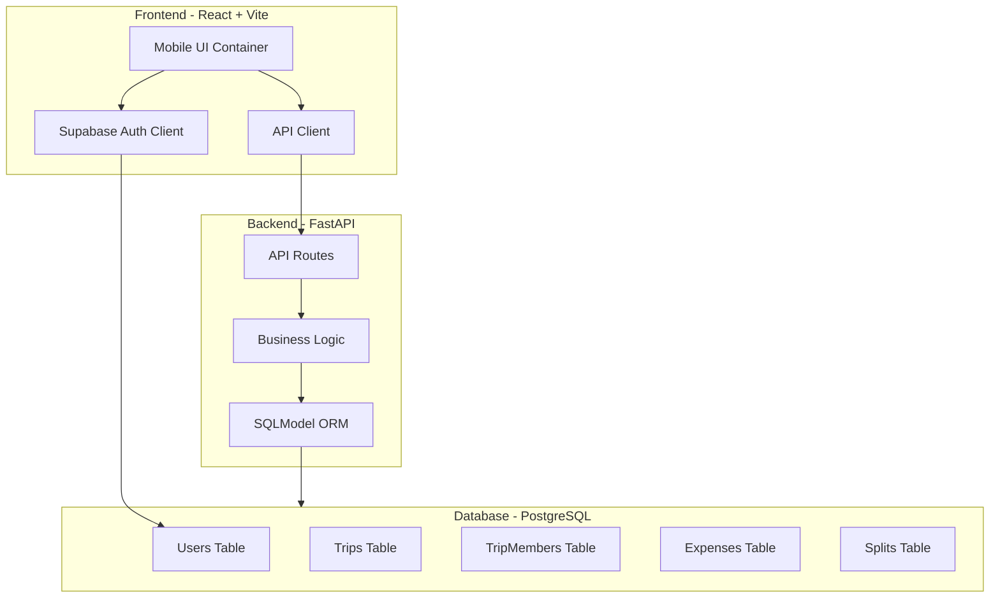

# Velo Travel Expense Tracker - Implementation Plan

## Architecture Overview




## Project Structure

```javascript
/velo
├── frontend/               # React + Vite + Tailwind
├── backend/                # FastAPI + SQLModel
├── supabase/               # Supabase CLI config & migrations
│   ├── config.toml
│   └── migrations/
├── docker-compose.yml      # Production/staging deployment
├── .gitignore
└── README.md
```


## Phase 1: Project Foundation

### 1.1 Initialize Project Structure

- Create monorepo folder structure (frontend/, backend/, supabase/)
- Set up `.gitignore` for Python, Node.js, and environment files
- Create root `README.md` with setup instructions
- Initialize Supabase CLI configuration in `/supabase`

### 1.2 Backend Setup

- Initialize FastAPI project in `backend/` with proper structure:
- `backend/app/main.py` - FastAPI application entry point
- `backend/app/core/config.py` - Environment configuration using Pydantic Settings
- `backend/app/core/database.py` - SQLModel engine and session management
- `backend/app/models/` - SQLModel schemas
- `backend/app/api/` - Route handlers
- `backend/app/services/` - Business logic
- Create `backend/requirements.txt` with: fastapi, uvicorn, sqlmodel, psycopg2-binary, supabase, pydantic-settings, python-jose
- Set up pytest structure in `backend/tests/`

### 1.3 Frontend Setup

- Initialize Vite + React + TypeScript project in `frontend/`
- Configure Tailwind CSS with mobile-first breakpoints
- Install dependencies: @supabase/supabase-js, react-router-dom, axios, date-fns
- Set up Vitest for testing
- Create mobile container layout component (`max-w-md` centered wrapper)

### 1.4 Docker & Deployment Config

- Create `docker-compose.yml` for production with services:
- PostgreSQL (with initialization scripts)
- Backend (FastAPI with gunicorn)
- Frontend (Nginx serving static build)
- Add health checks and volume configurations

## Phase 2: Database Schema & Migrations

### 2.1 SQLModel Schemas

Define models in `backend/app/models/`:

- **`user.py`**: User model (synced with Supabase auth.users)
- **`trip.py`**: Trip model with base_currency, start_date, end_date
- **`trip_member.py`**: TripMember with nullable user_id, nickname, is_fictional flag
- **`expense.py`**: Expense with paid_by_member_id, amount, currency, exchange_rate
- **`split.py`**: Split junction table linking expenses to members

Key relationships:

- Trip → TripMembers (one-to-many)
- TripMember → User (many-to-one, nullable)
- Expense → TripMember (paid_by)
- Expense → Splits (one-to-many)
- Split → TripMember (many-to-one)

### 2.2 Supabase Migrations

- Create SQL migration files in `supabase/migrations/`
- Add Row Level Security (RLS) policies:
- Users can only see trips they're members of
- Only trip members can create/edit expenses
- Fictional members are visible to all trip participants
- Create indexes on foreign keys and frequently queried fields

## Phase 3: Authentication & Authorization

### 3.1 Supabase Auth Integration

- Backend: Create JWT verification middleware using Supabase public key
- Frontend: Set up Supabase client with auth hooks
- Implement protected route wrapper component
- Create login/signup pages with email/password

### 3.2 User Profile Management

- API endpoints: `GET/PUT /api/users/me` for profile management
- Frontend: Settings page for display_name and avatar_url

## Phase 4: Core Features - Trips & Members

### 4.1 Trip Management APIs

Implement in `backend/app/api/trips.py`:

- `POST /api/trips` - Create trip with base_currency
- `GET /api/trips` - List user's trips
- `GET /api/trips/{trip_id}` - Get trip details with members
- `PUT /api/trips/{trip_id}` - Update trip info
- `DELETE /api/trips/{trip_id}` - Soft delete trip

### 4.2 Fictional Member Logic

Implement in `backend/app/api/members.py`:

- `POST /api/trips/{trip_id}/members` - Add member (fictional or real user)
- `GET /api/trips/{trip_id}/members` - List all members with balances
- `POST /api/trips/{trip_id}/members/{member_id}/claim` - Claim fictional identity (updates user_id, transfers all debt)
- `DELETE /api/trips/{trip_id}/members/{member_id}` - Remove member (only if no expenses)

### 4.3 Invitation System

- Generate unique invite tokens (JWT with trip_id, expires in 7 days)
- `POST /api/trips/{trip_id}/invites` - Generate invite link
- `POST /api/invites/{token}/accept` - Accept invite and join trip

### 4.4 Frontend - Trips & Members UI

- Trip list page with create trip modal
- Trip detail page showing members and quick stats
- Add member modal (search existing users or add fictional)
- Invite link generator and share functionality

## Phase 5: Expense Management & Multi-Currency

### 5.1 Currency Service

Create `backend/app/services/currency.py`:

- Fetch live exchange rates (use exchangerate-api.io or similar free API)
- Cache rates for 1 hour to avoid excessive API calls
- Allow manual override on expense entry

### 5.2 Expense APIs

Implement in `backend/app/api/expenses.py`:

- `POST /api/trips/{trip_id}/expenses` - Create expense with splits
- Accept: amount, currency, paid_by_member_id, split_equally (bool), custom_splits (array)
- Calculate exchange_rate_to_base at time of entry
- Create Split records in transaction
- `GET /api/trips/{trip_id}/expenses` - List expenses with pagination
- `PUT /api/expenses/{expense_id}` - Update expense (recalculate splits)
- `DELETE /api/expenses/{expense_id}` - Delete expense (cascade to splits)

### 5.3 Split Logic Service

Create `backend/app/services/splits.py`:

- `calculate_equal_splits(amount, member_ids)` - Divide equally, handle remainders
- `calculate_custom_splits(amount, split_config)` - Validate custom percentages/amounts
- Ensure splits always sum to expense amount

### 5.4 Frontend - Expense Entry

- Expense creation form with:
- Amount input with currency selector (common currencies + search)
- Live exchange rate display with manual override option
- Date picker
- Description field
- "Paid by" member selector
- Split options: equally among all, equally among selected, custom amounts
- Expense list page with filters (by member, date range, currency)
- Swipe-to-delete gesture for expense items
- Pull-to-refresh for expense list

## Phase 6: Settlement Engine & Balances

### 6.1 Balance Calculation Service

Create `backend/app/services/settlements.py`:

- `calculate_member_balances(trip_id)` - For each member:
- Total paid (sum of expenses where paid_by_member_id = member)
- Total owed (sum of splits where member_id = member)
- Net balance = Total paid - Total owed (in base currency)
- Cache results with trip version counter (invalidate on expense changes)

### 6.2 Optimal Settlement Algorithm

Implement greedy debt settlement:

```python
def calculate_optimal_settlements(balances):
    # balances = {member_id: net_balance}
    givers = sorted([{member, amt} for member, amt in balances.items() if amt > 0], reverse=True)
    receivers = sorted([{member, amt} for member, amt in balances.items() if amt < 0])
    
    settlements = []
    while givers and receivers:
        giver = givers[0]
        receiver = receivers[0]
        amount = min(giver['amt'], abs(receiver['amt']))
        
        settlements.append({
            'from': receiver['member'],
            'to': giver['member'],
            'amount': amount
        })
        
        giver['amt'] -= amount
        receiver['amt'] += amount
        
        if giver['amt'] == 0: givers.pop(0)
        if receiver['amt'] == 0: receivers.pop(0)
    
    return settlements
```


### 6.3 Settlement APIs

- `GET /api/trips/{trip_id}/balances` - Get all member balances
- `GET /api/trips/{trip_id}/settlements` - Get optimal settlement transactions
- `POST /api/trips/{trip_id}/settlements/{settlement_id}/mark-paid` - Mark settlement as completed (optional feature)

### 6.4 Frontend - Balances UI

- Balances page showing:
- Each member's net position (owes/owed)
- Color coding (green for positive, red for negative)
- Tap member to see detailed expense breakdown
- Settle Up page showing:
- Minimal transaction list (who pays whom)
- Shareable summary text
- Mark as paid buttons (optional)

## Phase 7: UI/UX Polish & Mobile Optimization

### 7.1 Mobile Container Strategy

- Create `MobileContainer` component wrapper
- Desktop: `max-w-md mx-auto shadow-lg` with subtle phone mockup
- Mobile: Full width with safe area padding

### 7.2 Navigation

- Bottom tab bar component (fixed position)
- Tabs: Trips, Expenses, Balances, Profile
- Active state indication
- Route persistence

### 7.3 Loading & Error States

- Skeleton loaders for lists
- Toast notifications for success/error messages
- Empty states with illustrations
- Offline detection banner

### 7.4 Gestures & Interactions

- Pull-to-refresh on lists (use react-use-gesture)
- Swipe-to-delete on expenses
- Long-press for quick actions
- Touch-friendly tap targets (min 44px)

## Phase 8: Testing

### 8.1 Backend Tests

Using pytest in `backend/tests/`:

- Unit tests for services (currency, splits, settlements)
- Integration tests for API endpoints with test database
- Test fixtures for common scenarios (trip with expenses, fictional members)
- Test concurrency with multiple simultaneous expense entries

### 8.2 Frontend Tests

Using Vitest in `frontend/tests/`:

- Component tests for forms and UI elements
- Integration tests for user flows (create trip → add expense → view balances)
- Mock Supabase client for auth tests

## Phase 9: Documentation & Deployment

### 9.1 Documentation

- Update root `README.md` with:
- Quick start guide (Supabase CLI setup)
- Development workflow
- API documentation link
- Architecture diagram
- Create `backend/API.md` with endpoint documentation
- Add inline code comments for complex logic

### 9.2 Environment Configuration

- `.env.example` files for frontend and backend
- Document required Supabase credentials
- Document external API keys (currency exchange)

### 9.3 Deployment Guide

- Docker Compose deployment instructions
- Environment variable setup for production
- Database migration workflow
- CI/CD suggestions (optional)

## Key Technical Decisions

1. **Concurrency**: Use PostgreSQL transactions with row-level locking on trip updates to handle simultaneous expense entries
2. **Currency Storage**: Always store original currency + exchange rate, never lose precision
3. **Fictional Members**: Nullable `user_id` in TripMembers table allows seamless claiming without data migration
4. **Debt Settlement**: Greedy algorithm is O(n log n) and produces near-optimal results for typical group sizes
5. **Mobile-First**: All components designed for touch, desktop is just a centered mobile view